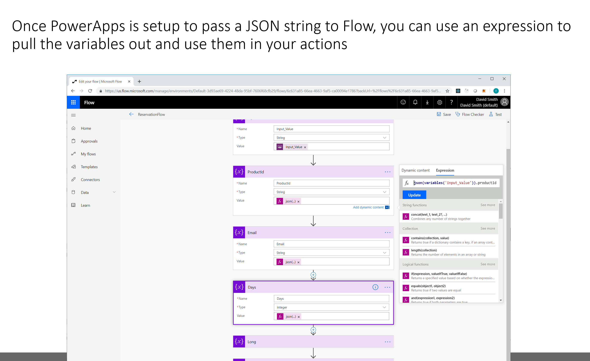
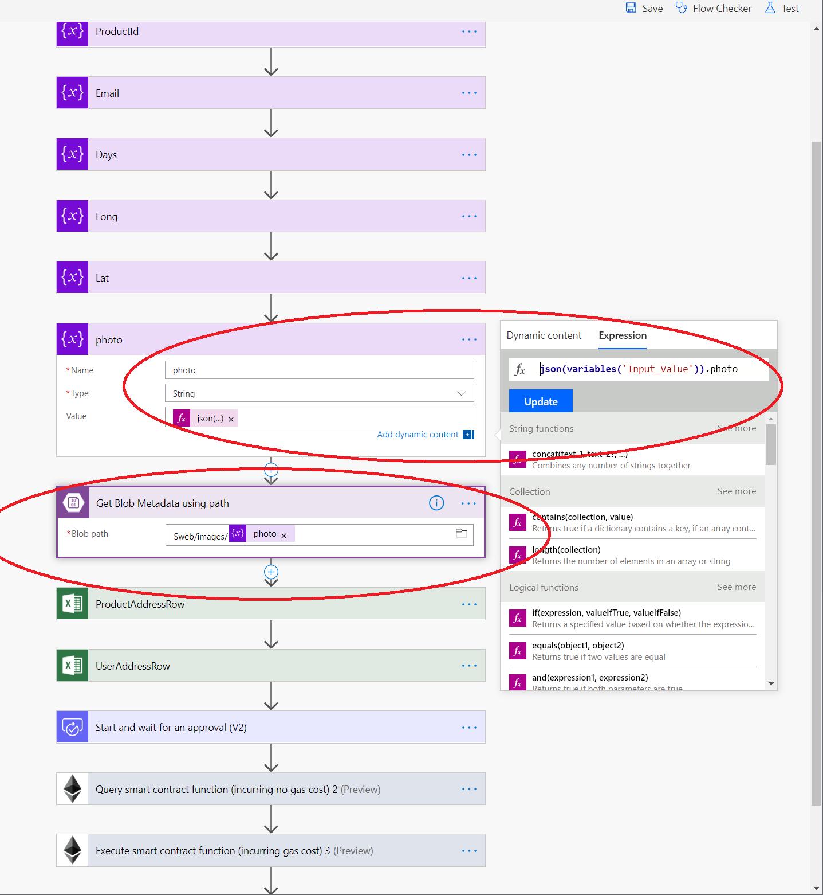
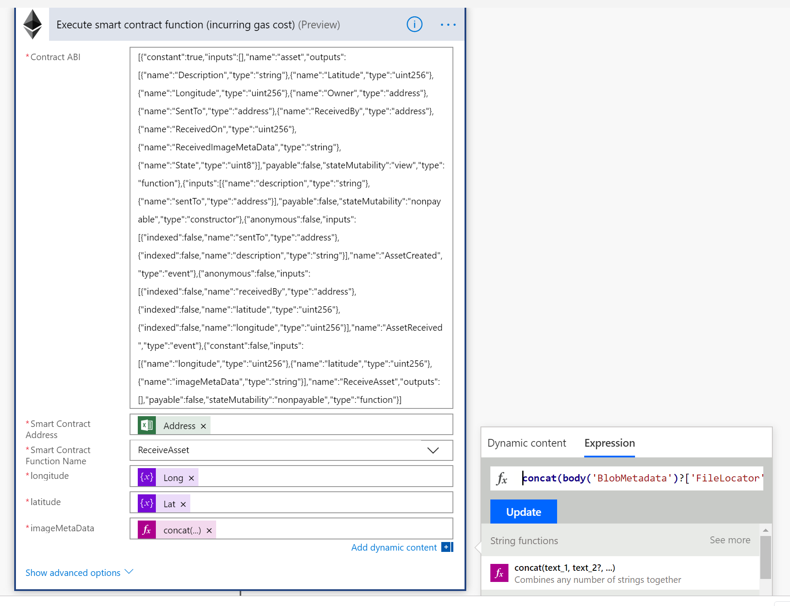
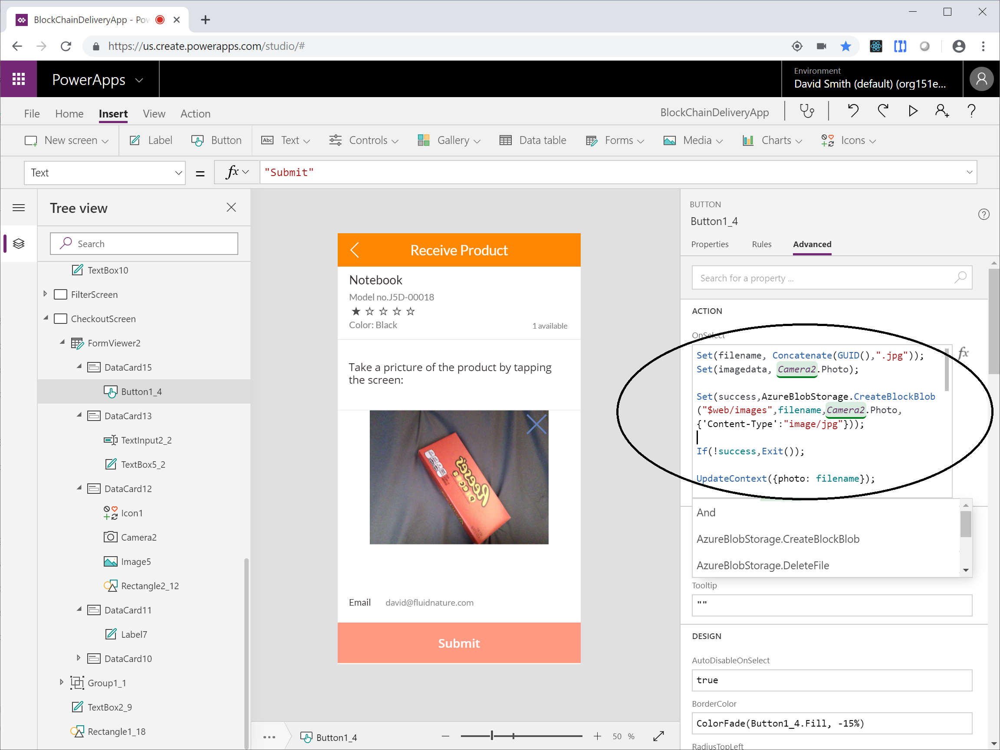
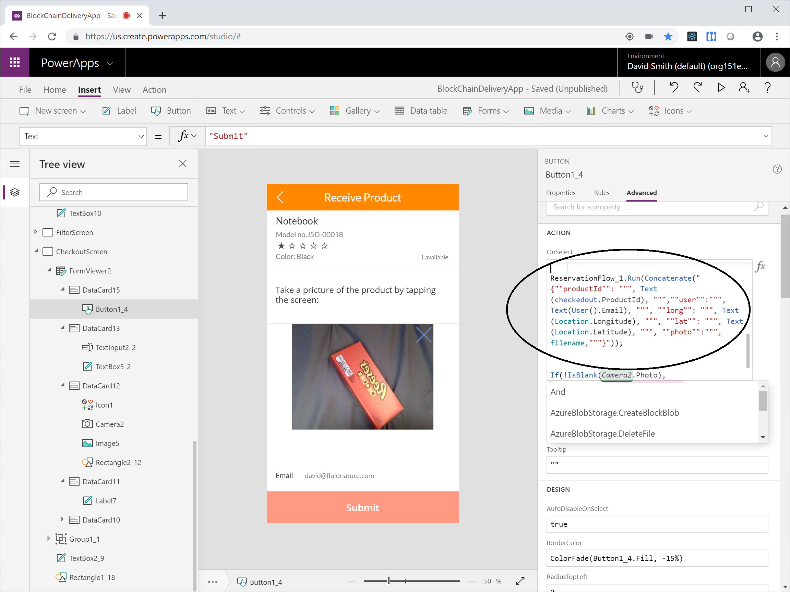

# Supply Chain – Delivery Confirmation And Attestation

## Table of contents

- Overview
- Setup
  1. Smart Contracts
  2. Data
  3. Azure Blob Storage
  4. Flow - from the sample (zip file)
  5. Flow - from scratch
  6. PowerApp - from the sample (msapp file)
  7. PowerApp - from scratch
- Screenshots

## Overview

---

This sample demonstrates:

- To prepare a product for delivery, the manufacturer creates an instance of Asset smart contract
- The manufacturer assigns the recipient as a counterparty 
- When the customer/counterparty receives the product, she opens the Delivery PowerApp
- The customer takes a picture of the product and submits it to accept delivery
- The PowerApp uploads the picture to Azure BlobStorage and send it to a Microsoft Flow  
- The Flow retrieves the image metadata from BlobStorage
- The Flow uses Ethereum Blockchain Connector to "ReceiveAsset"
- The Flow sends an email confirm the delivery with the transaction hash

---

### Technologies

- Ethereum Blockchain Connector
- Ethereum Smart Contracts
- PowerApps
- Microsoft Flow 
- Azure BlobStorage

---

### Caveats

- For the purposes of simplicity, some data is stored in Excel on OneDrive. In a real scenario, the Microsoft Flow should be refactored for any real-world scenario

---

### Sample Files

1. Asset.sol - smart contract
2. DeliveryFlow.zip - Microsoft Flow
4. data.xlsx - example spreadsheet with data (in real world, use a database)

---

# Setup

## Smart Contracts

see: ./Asset.sol

- State
    string Description;
    uint Latitude;
    uint Longitude;
    address Owner;
    address SentTo;
    address ReceivedBy;
    uint ReceivedOn;
    string ReceivedImageMetaData;
    StateType State;

- Events

  - AssetSent(address sentTo, string description);
  - AssetReceived(address receivedBy, uint latitude, uint longitude);

- Methods

  - constructor(description, sentTo)
  - ReceiveAsset(uint longitude, uint latitude, string memory imageMetaData)

--- 

## Data

For the purposes of demonstration, this sample pre-defines some data and stores it on OneDrive. To move the data, replace the Microsoft Flow OneDrive Excel Connector actions with your data source.

1. Products

    - The Products in the App need to be pre-provisioned to the Blockchain
    - After registering each Product, update the data.xlsx Products table with its smart-contract address

            // in Truffle (async):
            Asset.new('test', [customer-address]).then(x => x.address)

2. Users
    - The Users of the App need to be pre-provisioned Accounts on the Blockchain
    - Open data.xlsx Users table and update the Email and Address

3. To use OneDrive, upload the data.xlsx and update the Microsoft Flow OneDrive Excel actions with the location of the file and the table name

---

## Azure Blob Storage

1. You will need the storage account name, folder path and access key from an Azure Block Blob

---

## Flow - from the sample (zip file)

1. Import the DeliveryFlow.zip file 
2. Setup the data connections.

  - You may need to swap out some of the data connections for different actions.         
      
         Example: the Outlook.com and OneDrive actions and connections do not work with Office 365

  
  - One of the connections is an HTTP call to Hash a string. You will need to provide the API (see the Azure Functions sample)

  - If you use the Excel files for data, you must individually reconnect the Excel actions with the location of your files (on OneDrive, etc)

---

## Flow - from scratch

### Setup PowerApp trigger 

1. Create a Flow with a PowerApp Trigger
2. Create "Initialize Variable" action
2. Name the Action "MyInput", and set type to String
3. Focus in the Value box, and the dialog menu will open
4. Click the "See More" link under the search box (on the right).
5. Click the "Ask in PowerApps" link - this will create a variable with the name of the "MyInput_Value"
6. (For ease of use) add additional "Initializer Variable" for each property you are going to send from PowerApps, using expression:

        json(variables('MyInput_Value')).subProperty1

### Setup Azure BlobStorage metadata action

1. In the previous step, make sure a variable has been to receive the image name from the PowerApp 
2. In Azure, setup a Storage account, with a new block blob
3. In Flow, setup the Azure BlobStorage connection, with the storageaccountname and its access key
4. Add the "Azure Blob Storage / Get Blob Metadata using path" action
5. Use the Expression editor to concatenate the block blob path name and the image name variable

        $web/images/@{variables('photo')}

### Setup Hash action

1. Configure the "Hash" action to call an API that will return a hash of the metaddata

        Note: there is a sample that shows how to do this with an Azure Function

### Setup Ethereum Blockchain Connector action

1. Add the Ethereum Blockchain Connector, add the ABI for Asset.sol, the Product's smart contract address
2. Enter the smartcontract address of the Product
  - In this example, the Flow looks up the address (using the ProductId) in an Excel spreadsheet. In a real scenario the address could be in a database
3. Select the appropriate contract method, and configure the arguments using variables from the previous actions

---

## PowerApp - from the sample (msapp file)

  1. The .msapp file can be imported into your PowerApps account. Data connections will need to be setup and re-associated.
  
  2. The PowerApp uses your Location and Camera, they must be approved by your browser / phone  
  
  3. Many of the connections are shared between Flow and the PowerApp, but they can get out of sync. 
  

  4. You will probably need to re-associate the Flow with the PowerApp, and then update the code in the PowerApp to use the newly associated Flow.
  
    NOTE: Connecting a Flow to an existing PowerApp Screen can sometimes automatically replace your existing event code. To work around this problem:

    - Create a new Screen. 
    - Click Actions / Flows
    - Click on the Flow you added above
    - Pay attention to the name of the Flow that was added
    - Delete the new Screen
    - Goto to the Screen where you actually need to execute the flow from
    - Click on the Button that triggers the action
    - Go to the Properties panel and click on Advanced
    - Double click inside the OnSelect event
    - Find the old Flow reference, and replace its name with the name of the newly added flow:

    ReservationFlow_1.Run(Concatenate("{""days"": ", Text(reserveDays), ", ""productId"": """, Text(checkedout.ProductId), """,""user"":""", Text(User().Email), """, ""long"": """, Text(Location.Longitude), """, ""lat"": """, Text(Location.Latitude), """, ""photo"":""",filename,"""}"));

---

## PowerApp - from scratch

  1. Create a new PowerApp
  2. Create the necessary screens

### Take a Photo in PowerApp and save it to Azure Blob

  1. Use the AzureBlobStorage connector configured in the Microsoft Flow instructions (normally they share connections)
  2. Insert Media/Camera object onto a screen in PowerApp
  3. Save the Photo to a variable when an event occurs - simplest is the Camera OnSelect event (when the user taps the picture) 

          set(myphoto, Camera1.Photo)

  4. Send the Photo to Azure using the AzureBlobStorage connector. Set a filename that you can send to Flow later:

          Set (filename, Concatenate(GUID(),".jpg"));
  
  5. Call CreateBlobBlob, with the 

          Set(success,AzureBlobStorage.CreateBlockBlob("$web/images",filename,Camera2.Photo,{'Content-Type':"image/jpg"}));

  5. Send the Photo name to your Flow. Add the Photo filename as another key/value pair:

          MyFlow.Run("{ ""photo"": """ + filename + """}");

### Trigger Microsoft Flow

  3. From an event, click Action / Flows and add the Flow you previously created
  4. Edit the event 
  5. Make sure you have all the necessary properties, formatted as a JSON string
  6. Execute the [FlowApp].Run([JSON_String_With_Required_Params])

          MyFlow.Run("{ ""prop1"": """ + value1 + """ }");

---

# Screenshots

## Flow App

---

---

Get the Blob storage metadata for the photo

---

---

Configure Ethereum Smart Contract connector

---

## PowerApp

Make sure blob storage account is configured

Add a Camera object, and send the Image to Blob Storage

---

Execute the Flow, and pass the arguments as a string of JSON

---

