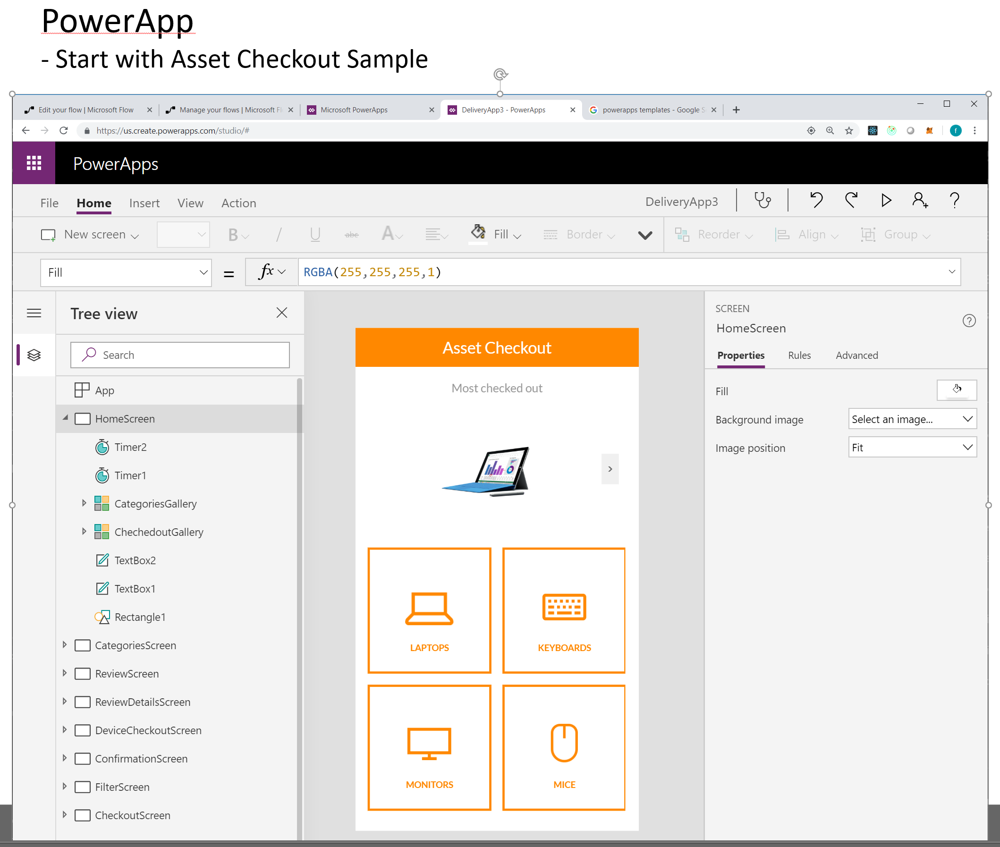
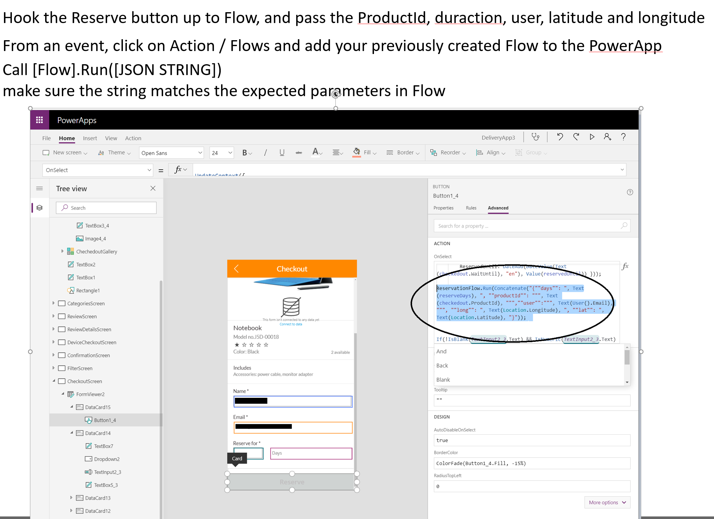
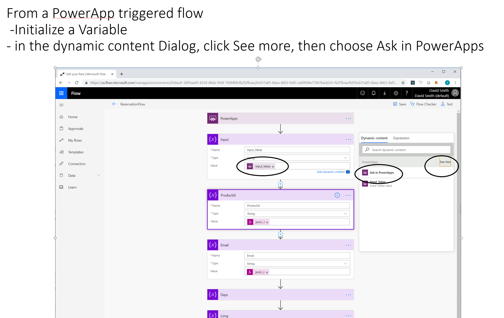
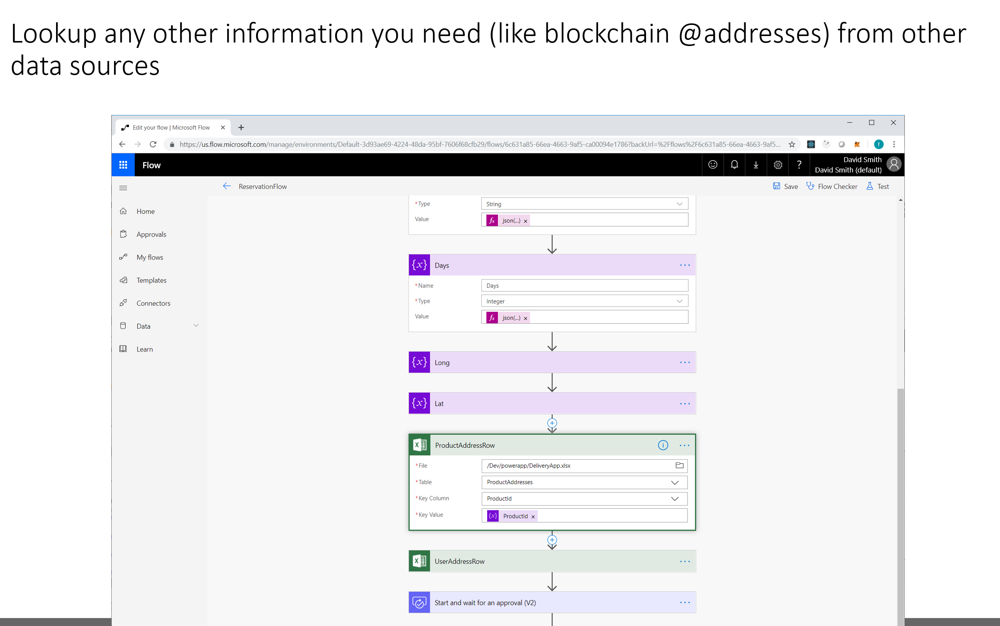
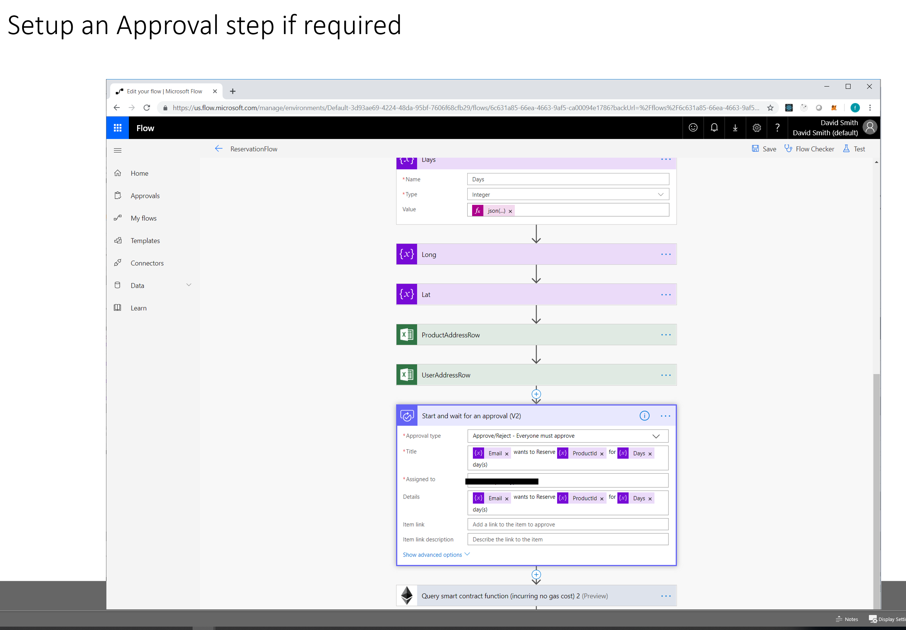
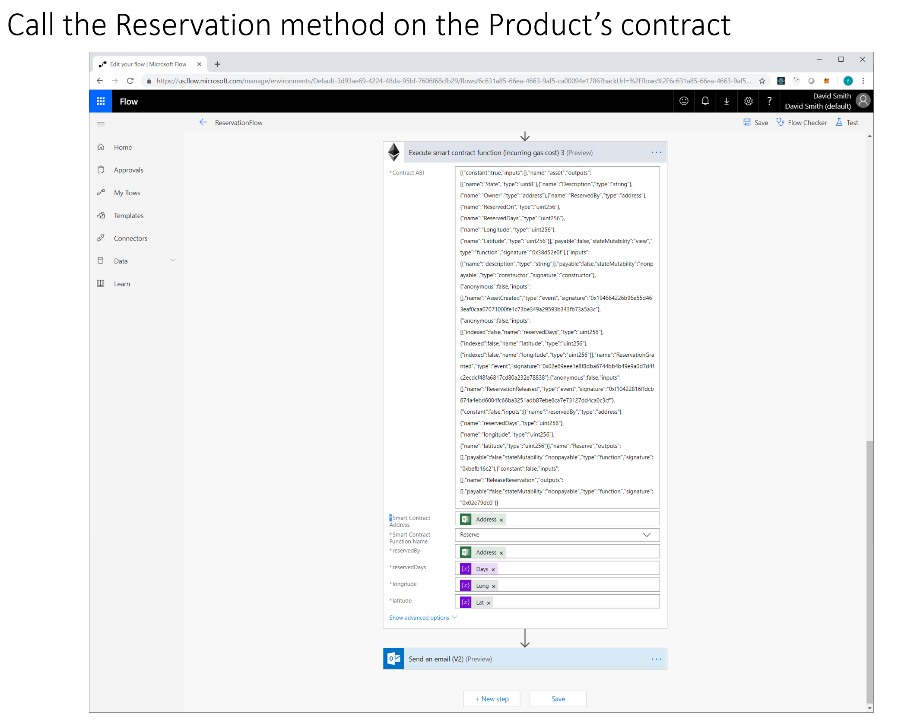
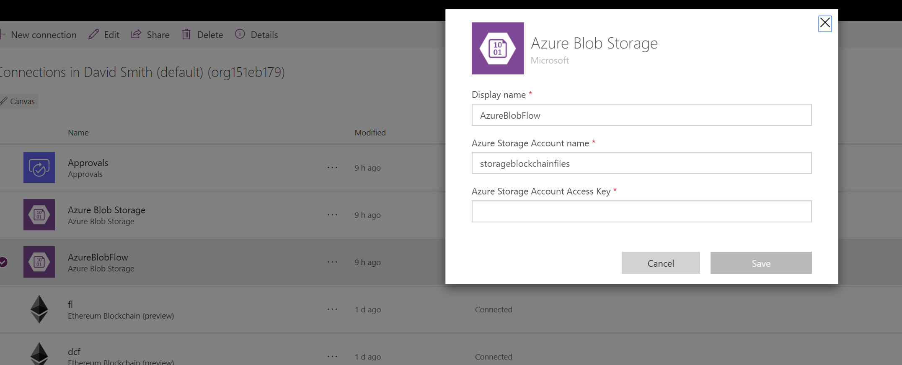
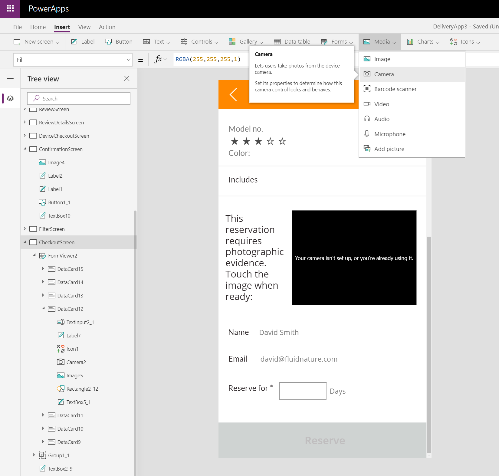
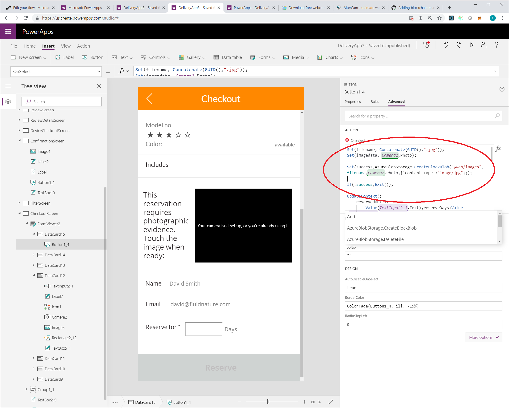

# Reservation Approval and Assignment on the Blockchain with Attestation and Location

## Files

1. Asset.sol smart contract
2. PowerPoint with screenshots

---

## Asset example

see: ./Asset.sol

- State
  - StateType State;    //reserved or available
  - string Description; //asset description
  - address Owner;
  - address ReservedBy;
  - uint ReservedOn;
  - uint ReservedDays;
  - uint Longitude;
  - uint Latitude;

- Methods

  - Reserve(reserveFor, numberOfDays, latitude, longitude)
     - must be Owner of the Asset

  - ReleaseReservation()
     - until the Reservation is complete, only the Reservation holder can release the reservation

---

## Creating Microsoft Flow to automate Ethereum, triggered by PowerApp

1. Create a Flow with a PowerApp Trigger
2. Create "Initialize Variable" action
2. Name the Action "MyInput", and set type to String
3. Focus in the Value box, and the dialog menu will open
4. Click the "See More" link under the search box (on the right).
5. Click the "Ask in PowerApps" link - this will create a variable with the name of the "MyInput_Value"
6. (For ease of use) add additional "Initializer Variable" for each property you are going to send from PowerApps, using expression:

        json(variables('MyInput_Value')).subProperty1

7. Make sure you either pass the blockchain address for the Product and the User from the PowerApp, or use the ProductId and UserEmail to call another datasource or blockchain to lookup the appropriate addresses
8. Add the Ethereum Connector, add the ABI for Asset.sol, add the Product's address, and select the Reserve method

---

## Create the PowerApp to trigger the Microsoft Flow

  1. Start with the Asset Checkout sample
  2. From any event, click Action / Flows and add the Flow you previously created
  3. Find the screen with the Reserve button, and edit the event. 
  4. Make sure you have all the necessary properties, formatted as a JSON string
  5. Execute the [FlowApp].Run([JSON_String_With_Required_Params])

        MyFlow.Run("{ ""prop1"": ""value2"" }");

---

## Take Photo in PowerApp and save it to Azure Blob

   1. In the PowerApp, add AzureBlobStorage connector

   - In Azure, setup a storage account and configure a block blob
   - Enter the Access Key and storageaccountname in the connector setup

   2. Insert Media/Camera object onto a screen in PowerApp
   3. Save the Photo to a variable when an event occurs - simplest is the Camera OnSelect event (when the user taps the picture) 
         set(myphoto, Camera1.Photo)

   4. Send the Photo to Azure using the AzureBlobStorage connector

      - set a filename that you can send to Flow later:

         Set(filename, Concatenate(GUID(),".jpg"));
      
      - call CreateBlobBlob, with the 
         
         Set(success,AzureBlobStorage.CreateBlockBlob("$web/images",filename,Camera2.Photo,{'Content-Type':"image/jpg"}));

   5. Send the Photo filename to the Flow you previously configured, as another key/value pair

---

## In Flow, get the Photo metadata to send to Blockchain

   1. Make sure the same AzureBlobStorage connector is setup for Flow
   2. Add a step to get the photo filename sent from the PowerApp
   3. Add the "Azure Blob Storage / Get Blob Metadata using path" action
   4. Configure the same path to the block blob you saved the file to, and add the filename variable from step 2:

      $web/images/@{variables('photo')}

   5. Configure the smart contract to receive the image ETag or other metadata as needed, from the Blob metadata action

---

# Screenshots

---

---

---

## Flow App

---

---

---

---

---

## PowerApp - Camera

---

---

---

## Flow - Photo metadata

---

